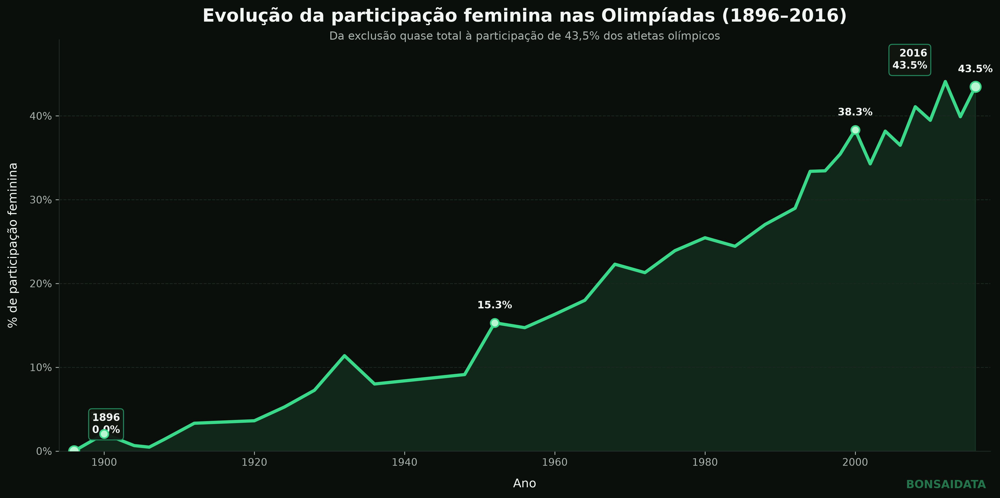

# **Olympic Analytics**  
   
*Evolução da participação feminina nos Jogos Olímpicos entre 1896 e 2016.*  
   
## **O que você encontrará aqui**  **(Atuais e features posteriores)**  
- Análises exploratórias de dados (EDA)  
- Estudos estatísticos  
- Visualizações e dashboards como adições futuras  
- Limpeza e tratamento de dados  
- Projetos práticos utilizando bases públicas  
- Experimentos e notebooks de aprendizado  
## **Tecnologias (Utilizadas até o momento)**  
- Python  
- Pandas  
- NumPy  
- Matplotlib  
- Jupyter Notebook  
   
## **O Projeto**  
Este projeto explora a evolução da participação feminina nos Jogos Olímpicos entre 1896 e 2016 utilizando Python, Pandas e Matplotlib.  
A análise busca compreender como a presença das mulheres nos Jogos evoluiu ao longo de mais de um século, identificando marcos históricos e tendências de crescimento. A partir de um dataset público do Kaggle, foram realizados processos de exploração, tratamento e visualização dos dados para transformar informações históricas em insights acessíveis.  
   
### **Principais resultados**  
- Participação feminina de 0,0% em 1896.  
- Participação feminina de 15,3% em 1952.  
- Participação feminina de 43,5% em 2016.  
- Crescimento contínuo da presença feminina ao longo da história olímpica.  
   
### **Leitura do gráfico**  
Esta análise investiga a evolução da participação feminina nos Jogos Olímpicos entre 1896 e 2016, utilizando dados históricos de atletas e eventos.  
O espaço das mulheres em 1896 neste âmbito, era praticamente inexistente. Em 2016, já representava uma parcela enorme dos atletas. O avanço não foi rápido nem linear, entretanto fora um avanço,  iniciando tímido, ganhando força no meio do século XX e acelerando bastante nas décadas finais.  
Por fim, o gráfico mostra mais do que números. Ele mostra o quanto o espaço das mulheres nas Olimpíadas foi sendo conquistado ao longo de mais de 100 anos. De uma porcentagem de 0% em 1896, para 15,3% em 1952, até 43.5% de participação em 2016.  
Esta base de dados postada pelo "Bhanupratap Biswas" na Kaggle foi essencial para evidenciar a história, que embora chocante, demonstre também de maneira positiva, o quanto a luta pelo espaço valeu à pena e cada vez mais, o mundo do esporte está mais democrático.  
   
## **Fonte dos Dados**  
Os dados utilizados nesta análise foram obtidos através do dataset “Olympic Data”, disponibilizado por “Bhanupratap Biswas” na plataforma Kaggle.  
Dataset:  
[https://www.kaggle.com/datasets/bhanupratapbiswas/olympic-data](https://www.kaggle.com/datasets/bhanupratapbiswas/olympic-data "https://www.kaggle.com/datasets/bhanupratapbiswas/olympic-data")  
   
## **Principais Conclusões**  
- A participação feminina saiu de 0% para 43,5% entre 1896 e 2016.  
- O crescimento foi gradual durante a primeira metade do século XX.  
- A aceleração mais significativa ocorreu após a década de 1950.  
- Em 2016 as mulheres já representavam quase metade dos atletas olímpicos.  
   
## **Fonte**  
Dataset obtido através do Kaggle:  
- Olympic Data  
- Autor do dataset: Bhanupratap Biswas  
   
   
**Autor do Projeto**  
Gabriel Araujo - Bonsai Data  
https://github.com/BonsaiData  
   
## **Sobre mim**  
Opa! Sou Gabriel, estudante de Ciência de Dados e entusiasta da análise de dados (iniciante), automação e resolução de problemas.  
Este repositório é meu espaço de experimentação, aprendizado e construção de portfólio. Aqui compartilho projetos, estudos e análises desenvolvidos ao longo da minha jornada na área de dados.  
Acredito que aprender vai muito além da teoria. Por isso, busco transformar dados em conhecimento, criar soluções práticas e documentar minha evolução técnica a cada novo projeto.  
Sempre aberto para trocar ideias, aprender coisas novas e conectar com pessoas que compartilham interesse por tecnologia, dados e inovação.  
 [https://github.com/BonsaiData](https://github.com/BonsaiData "https://github.com/BonsaiData") /  [in/gabriel-areujo-770728378](https://www.linkedin.com/in/gabriel-areujo-770728378 "https://www.linkedin.com/in/gabriel-areujo-770728378")  
   
## **Próximas Features**  
- Participação feminina por modalidade esportiva  
- Evolução das medalhas femininas ao longo do tempo  
- Comparação entre Jogos Olímpicos de Verão e Inverno  
   
